# BDD_AI

#### Introduction
Copilot-based BDD code generation, a low-code and no-code platform, includes test case management, export, and import. The generated code is completely based on your BDD development framework's code specifications, rather than randomly generated automation scripts, making it easier to maintain.

#### Software architecture
Developed based on JDK17+Maven3.9.9+SpringBoot3.3.0+HSQL database+Layui frontend+Appium v1.22.3, the code style and comments are highly standardized.
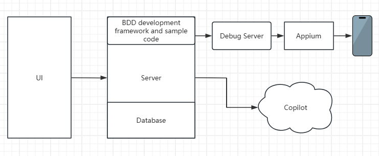

#### Installation Tutorial

1.  Set up an AOS or IOS automated testing development environment
2.  Launch DebugServer，MobileBDD/src/test/java/com/itproject/bdd/mobile/debug/DebugServer.java
3.  Launch AI service，BDD_AI/src/main/java/com/itproject/bdd/App.java
4.  Visit http://localhost:8080/ for test case management and code generation

#### Usage Tutorial

1.  Create a new test case, write the testcase in the web interface
    1.1 Create a new test case and generate code
    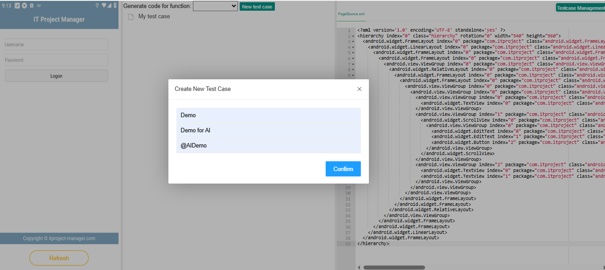
    1.2 Create step by step
    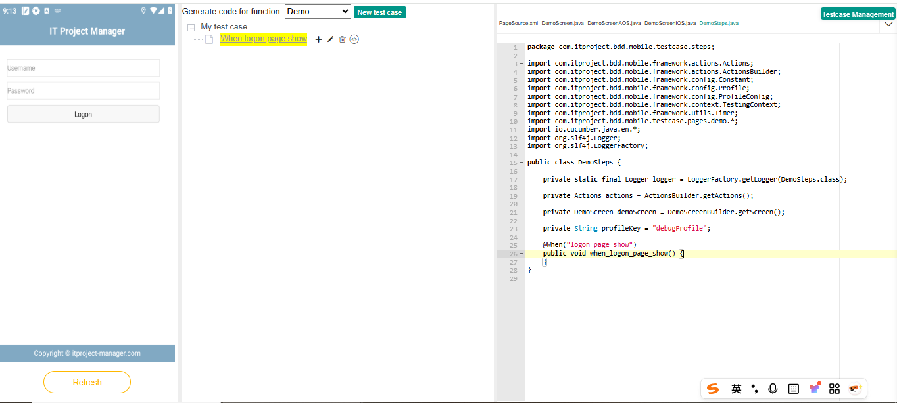
    1.3 Generate code step by step in Step. If there are any issues with the code generated by AI, you can modify the code through the interface and save it.
    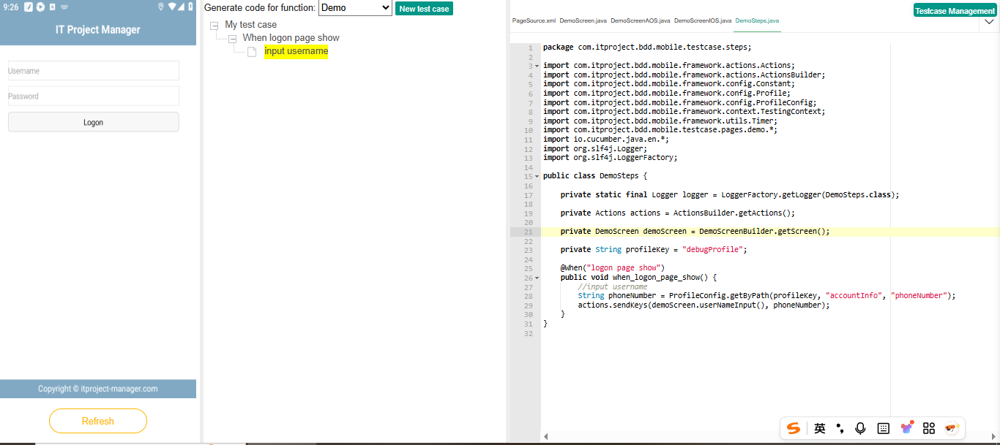
    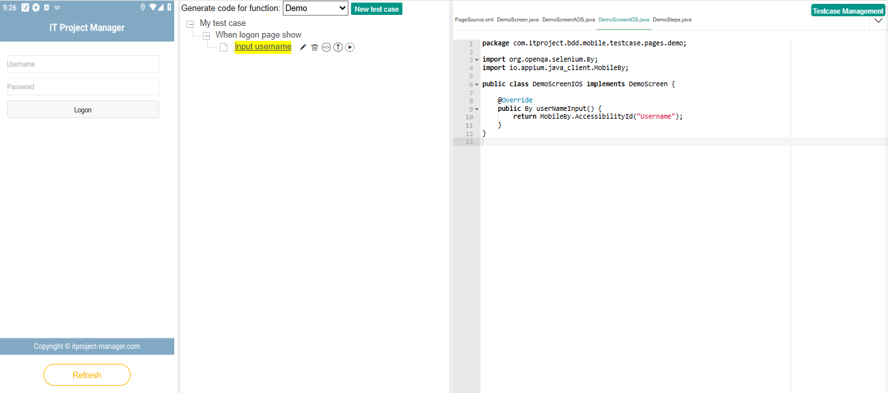
    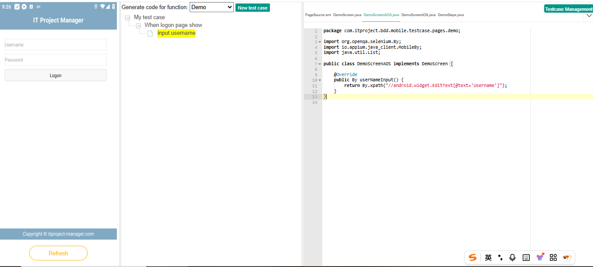
    
    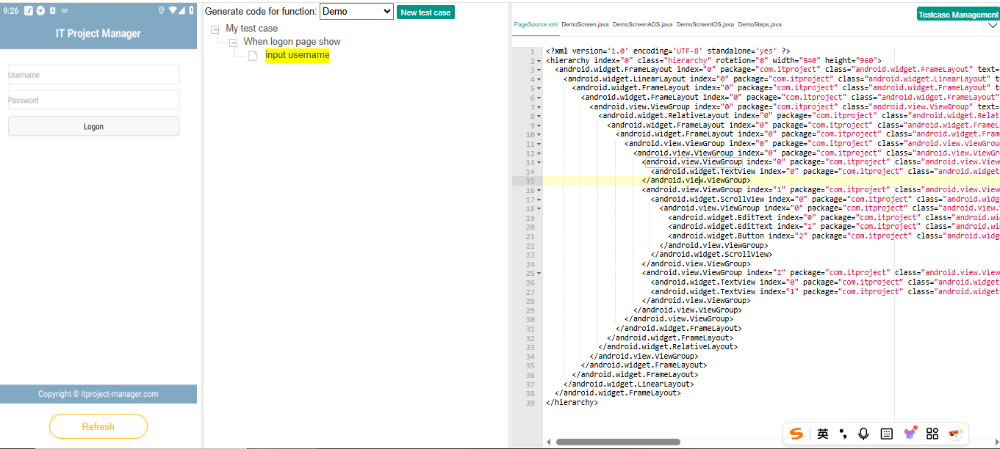
2.  Import and export test cases
    2.1 Export test cases
    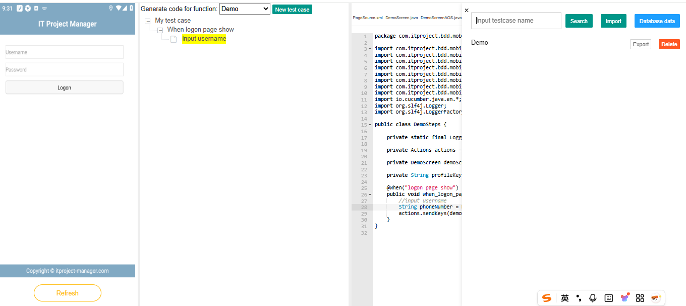
    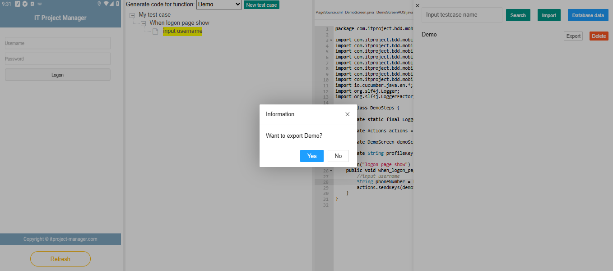
    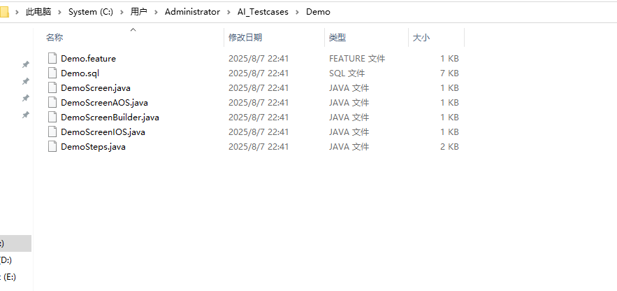
    2.2 Delete and import test cases
    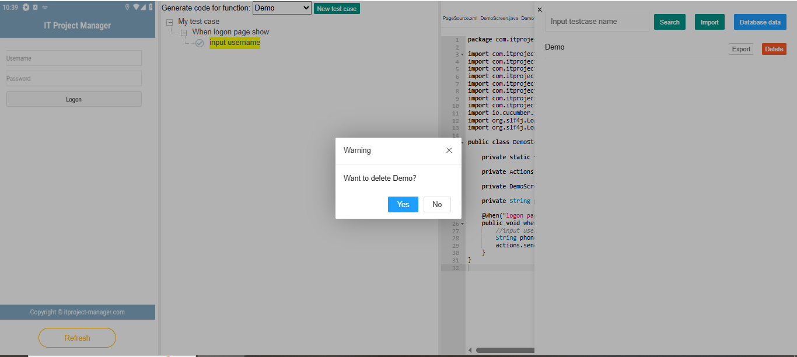
    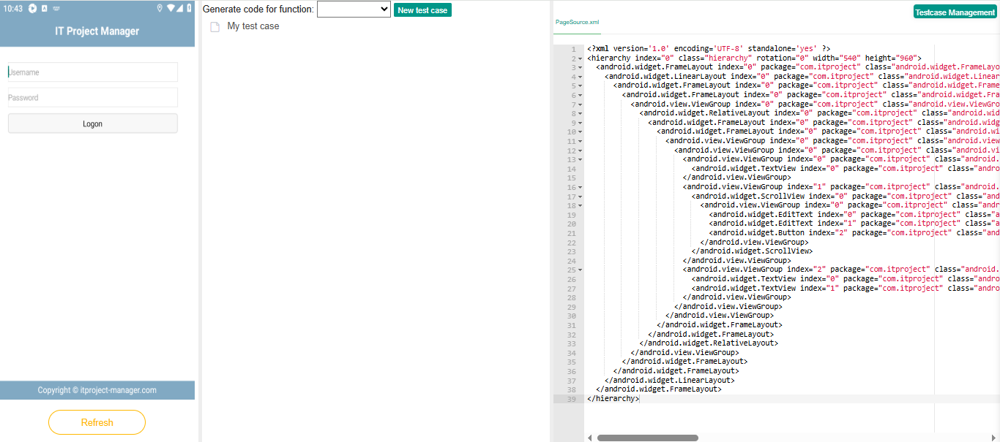
    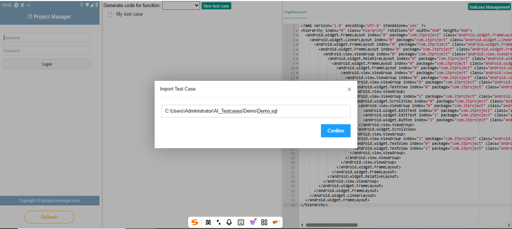
    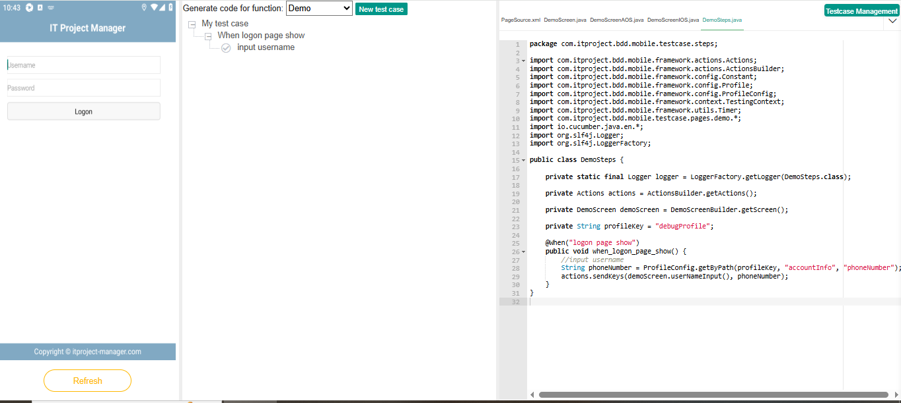
3.  Database data query
    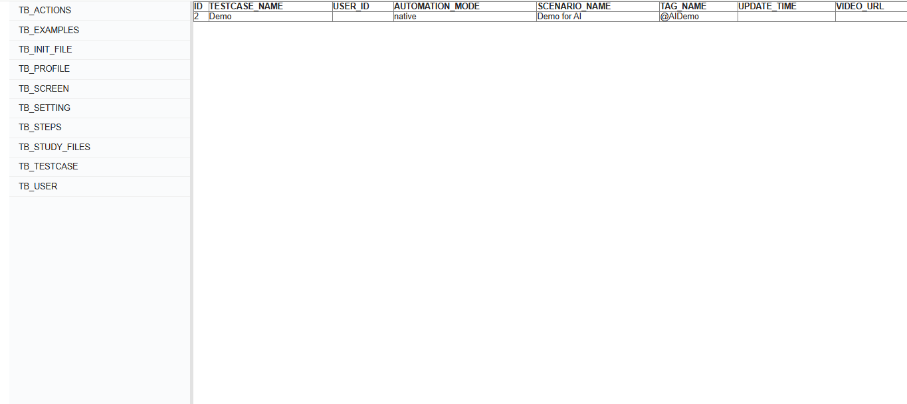
    
    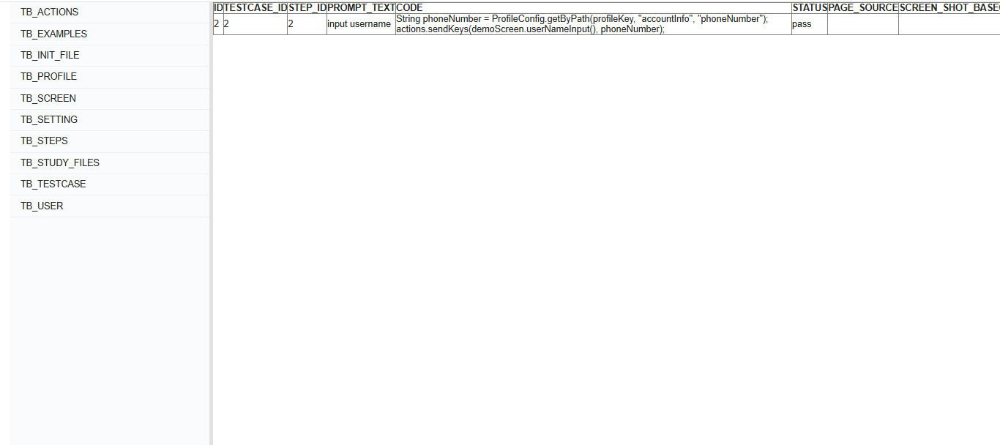

#### Project Code

1.  MobileBDD Automated Testing Framework
   https://github.com/VlikeIT/MobileBDD
3.  AI Server Code
    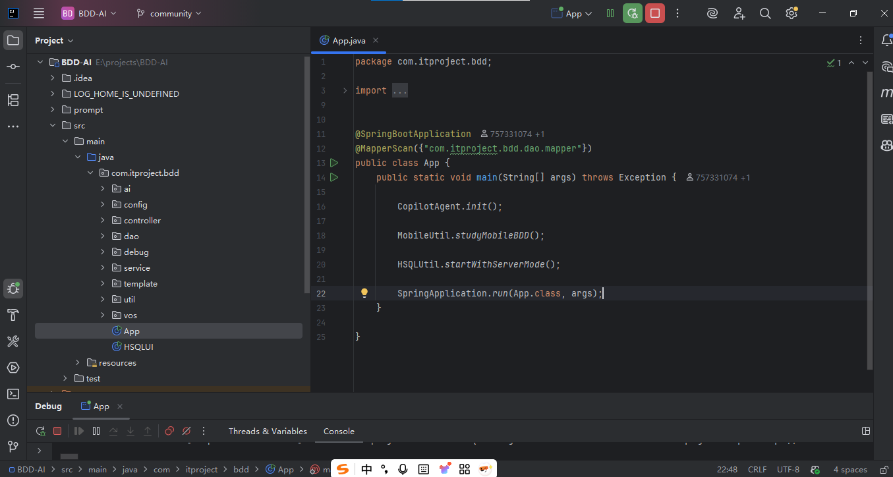

#### Supplementary

1.  In addition to generating BDD test code, you can also let AI learn the code of other frameworks and generate the code you want.
2.  This project is not free. If you want to learn about AI projects or if you happen to need a low-code platform for BDD automated testing, you can contact us to make a purchase.
3.  Purchasing this project comes with a complimentary MobileBDD development framework.

#### Contact Us
 
Or contact us by email: 465230373@qq.com

